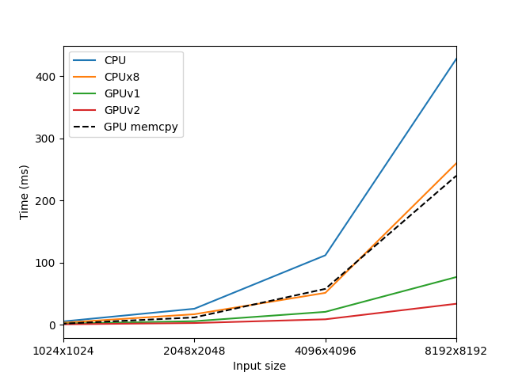

# Integral image computation

Let $I(x,y)$ be an image with indices denoted by $x$, $y$. The corresponding integral image is defined as
$$I_\Sigma(x,y)=\sum_{i=0}^{i<=x}\sum^{j<=y}_{j=0} I(x,y) .$$

## Serial computation
An algorithm to compute the integral image on a single CPU thread can be written as follows:

> **function** compute_integral_image (image[height,width])   
> &emsp;**for** i in [0..height-1]   
> &emsp;&emsp;**for** j in [0..width-1]   
> &emsp;&emsp;&emsp;integral_image[i][j] = image[i][j]   
> &emsp;&emsp;&emsp;**if** j > 0: integral_image[i][j] += integral_image[i][j-1]
>
> &emsp;**for** i in [1..height-1]   
> &emsp;&emsp;**for** j in [0..width-1]   
> &emsp;&emsp;&emsp;integral_image[i][j] += integral_image[i-1][j]   
> &emsp;**return** integral_image

This algorithm loops twice over the image, first computing cumulative sums over the image rows and then computing cumulative sums over the columns of the values computed in the first step. Assuming $w=h=\sqrt N$, the algorithm performs $2N$ iterations with a constant computational effort, implying an $O(N)$ computational complexity. A C++ implementation of this code is in the file `intimg.cpp`.

## Parallel computation
The above algorithm is well-suited for a multithreaded parallelization. An algorithm to compute the integral image using multiple CPU threads can be derived by a small modification of the serial variant:

> **function** compute_integral_image_parallel (image[height,width])  
> &emsp;start = id_thread * ⌈height / num_threads⌉   
> &emsp;stop = (id_thread+1) * ⌈height / num_threads⌉   
> &emsp;**for** i in [start..min(stop, height-1)]   
> &emsp;&emsp;**for** j in [0..width-1]   
> &emsp;&emsp;&emsp;integral_image[i][j] = image[i][j]   
> &emsp;&emsp;&emsp;**if** j > 0: integral_image[i][j] += integral_image[i][j-1]
>
> &emsp;start = id_thread * ⌈width / num_threads⌉   
> &emsp;stop = (id_thread+1) * ⌈width / num_threads⌉   
> &emsp;**for** i in [1..height-1]   
> &emsp;&emsp;**for** j in [start..min(stop, width-1)]   
> &emsp;&emsp;&emsp;integral_image[i][j] += integral_image[i-1][j]   
> &emsp;**return** integral_image

In this case, each of the $T$ threads computes the cumulative sums over a chunk of the rows (and columns in the second loop, respectively). The computational complexity per thread is thus $O(N/T)$. However, the algorithm has a high ratio of memory access operations (4 reads + 2 stores vs. 2 additions per pixel) which have a limited benefit from parallelization and in practice the speed-up will saturate upon reaching the memory bandwith. A C++ implementation of this code is in the file `intimg_omp.cpp`.

## GPU computation
The above parallel algorithm can also be implemented on a GPU, with one row/column per thread and a sufficient number of thread blocks (GPUv1; see `intimg.cu`). Thread blocks can be scheduled over multiple streaming multiprocessors (SMs) to maximally utilize the available CUDA cores. GPUs are equipped with memories having much larger bandwith than the CPU memory, providing acceleration even for algorithms with high memory access. This is somewhat counterbalanced by the need to transfer the data between the CPU and GPU memory.

Alternatively, we may assume the GPU programming paradigm of $T \approx N$ and have the cumulative sums in each row/column computed by a whole thread block using the inclusive prefix sum operation. The complexity of parallel prefix sum performed with $T$ threads on $G$ GPU multiprocessors is:
$$O\left(\frac{\sqrt{N}}{G} \left(\log{T} + \frac{\sqrt{N}}{T}\right)\right).$$
When $T=G=1$, this reduces to the complexity of the serial execution, $O(N)$; in the extreme case of $T=G=\sqrt{N}$, we obtain $O(\log N)$.

To ensure that the prefix sum is applied to consecutive elements in the memory, the image needs to be transposed before the second array scan. Another transpose needs to be performed after the second scan to restore the original image orientation. The complexity of a simple parallel transpose algorithm is $O(N / GT)$.

> **function** compute_integral_image_cuda_v2 (image[height,width])    
> &emsp;*split work between thread blocks*    
> &emsp;start = id_block * ⌈height / num_blocks⌉   
> &emsp;stop = (id_block+1) * ⌈height / num_blocks⌉  
> &emsp;**for** i in [start..min(stop,height-1)]   
> &emsp;&emsp;integral_image[i] = inclusive_prefix_sum(image[i])    
> &emsp;**barrier**    
> &emsp;integral_image = transpose(integral_image)    
> &emsp;*split work between thread blocks*  
> &emsp;start = id_block * ⌈width / num_blocks⌉   
> &emsp;stop = (id_block+1) * ⌈width / num_blocks⌉  
> &emsp;**for** i in [start..min(stop, width-1)]   
> &emsp;&emsp;integral_image[i] = inclusive_prefix_sum(image[i])    
> &emsp;**barrier**    
> &emsp;integral_image = transpose(integral_image)   
> &emsp;**return** integral_image

This variant (GPUv2) is implemented in `intimg2.cu`.

## Benchmarking
The four algorithm variants were tested on a PC with a 4-core CPU (Intel Core i7-8650U) and a NVidia GeForce GTX 1050 GPU (5 SMs with 128 CUDA cores each). On an image of size 4096x4096 pixels, the following times were obtained (mean of 25 runs):

| Algorithm | Time [ms] | Speedup |
|-----|-----|-----|
| CPU | 112 | 1x |
| CPUx8 | 51.56 | 2.2x |
| GPUv1 | 21 | 5.3x |
| GPUv2 | 9 | 12.4x |

Execution times for other image sizes are plotted below:

As expected, parallel implementation leads to substantial speedups, GPU variants in particular. However, copying data between the GPU and main RAM takes more time than the computation itself (approx. as much time as 8-threaded CPU computation). This may be discounted by using the data in GPU memory for further computations.

To run the benchmark, use `make run`.

## Volumetric computation
The algorithm can be directly extended to three-dimensional volumes by addition of a third loop performing cumulative sum over the third dimension to obtain a integral volume $V_\Sigma$. The summation of a box given by corner coordinates $(x,y,z) = (1,1,1)$ and $(2,2,2)$ is performed using the formula:
$$V_\Sigma(2,2,2)-V_\Sigma(1,2,2)-V_\Sigma(2,1,2)-V_\Sigma(2,2,1)+V_\Sigma(1,1,2)+V_\Sigma(1,2,1)+V_\Sigma(2,1,1)-V_\Sigma(1,1,1).$$
Attention should be paid to the numerical precision of value representation. For integral data types, an overflow is possible. For floating point numbers, errors occur when adding/subtracting values with varying exponent value. The severity of the error grows with the exponent difference up to $2^{24}$ when the smaller operand is completely lost:
$$2^{25}+2^1 \stackrel{\mathrm{FP32}}{=} 2^{25}$$

## Python bindings
Python bindings are realized with PyBind11 using a definition in file `bindings.cu`. Using `pybind11::array_t<T>`, we can access the buffer interface and operate directly on the numpy array memory buffer, avoiding copying the data between python and C++ representations. Bindings are compiled with the command `make bindings` and their function can be verified against a python implementation using `python test_bindings.py`.
